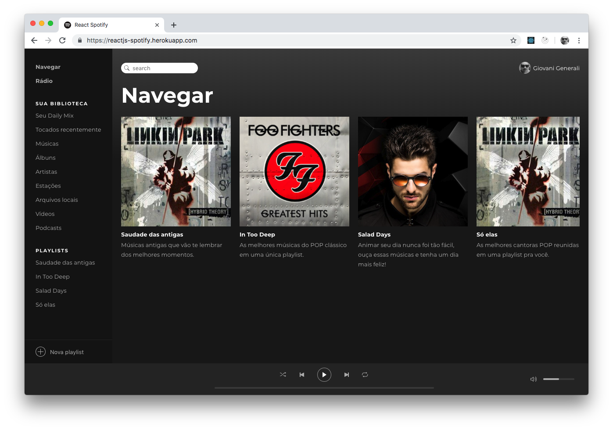
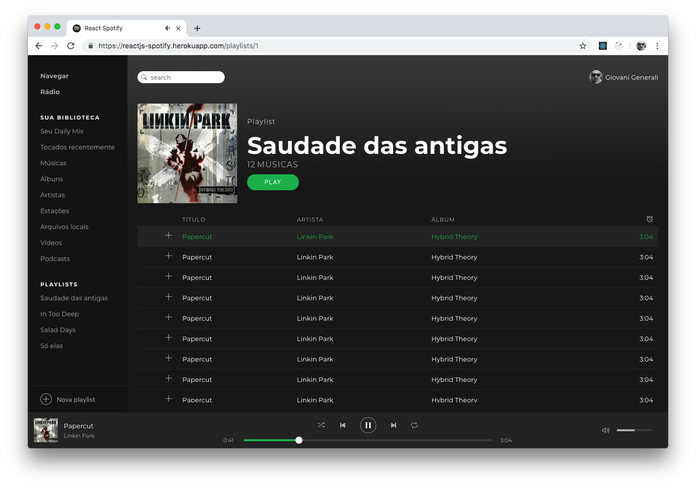

# React Spotify Clone

Aplicação desenvolvida no Bootcamp da Rocketseat.

A aplicação utiliza tecnologias como ReactJS, Redux, Redux-Saga, etc... para mais info consulte o `package.json`

Essa aplicação consome uma API que está publicada em https://spotify-api.glitch.me e o código fonte pode ser encontrado aqui https://glitch.com/edit/#!/spotify-api

